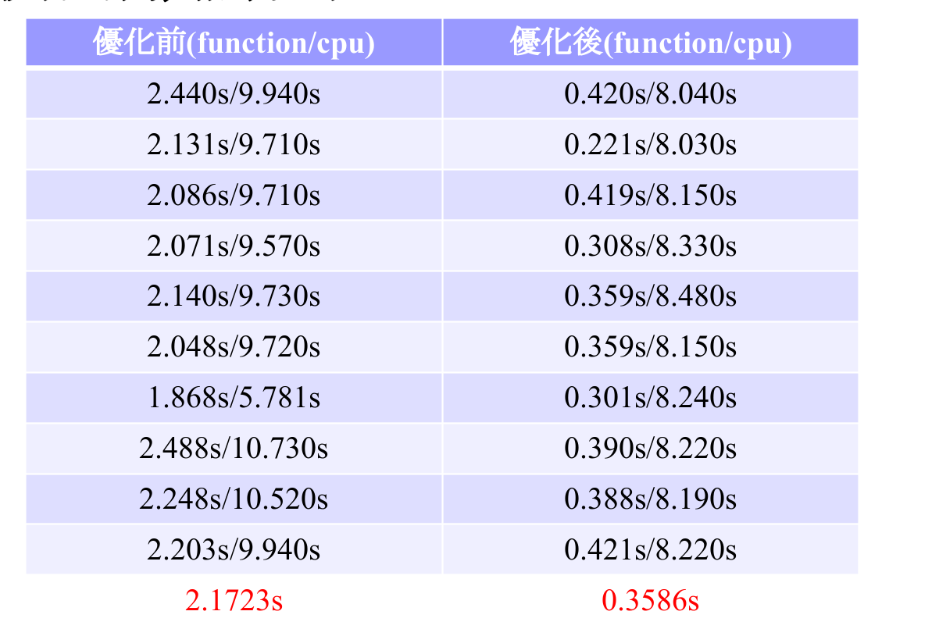
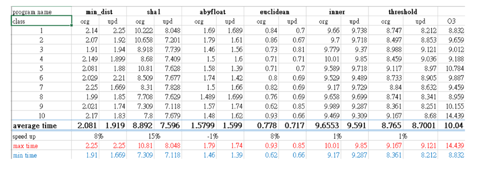

# ABY
## Topic
- Implementation and Performance Optimization of C Standard Library for Secure Computation between Two Parties.
### skill
- Cmake, C++
#### using tool 
- Vtune, gprof , Vscode
## Current Progress
1. support for C standard library in the MPC version

---

||CPU time(s)|support data type |Finish(%) |Verification|
|-----|--------|-----|--------|--|
|Floor|0.267s|double|80%||
|Ceil|0.275s|double|80%||
|Fabs|0.366s|double|80%||
|Power|2.111s|double|80%||
|exp|0.488s|float|80%||
|sqrt|0.720s|double|80%||
|sin|0.395s|double|80%||
|cos|0.394s|double|80%||
|tan|||0%||
|frexp|||0%||
|poly|||0%||
|cabs|||0%||
---
2. verification 
    - Currently, the validation method involves comparing the results with those 
      obtained from the original C standard library functions.
---
3. Optimization has been completed using Intel-supported intrinsic functions, 
  resulting in improved program performance as follows.
    - website
    - https://www.intel.com/content/www/us/en/docs/intrinsics-guide/index.html
---

---
## Expected Future Progress
1. Completeness of the verification method
2. Integrating existing functions to provide users with more convenience in usage
 

